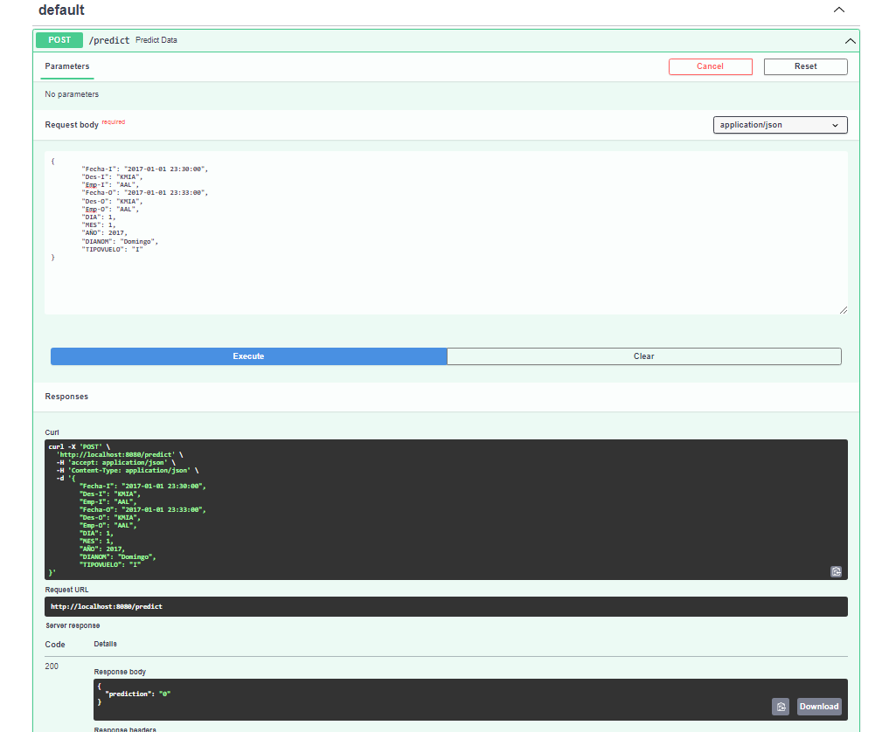
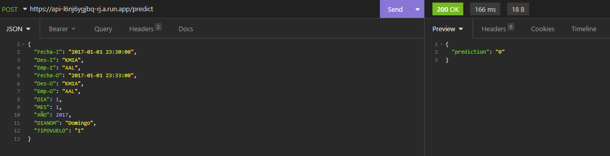
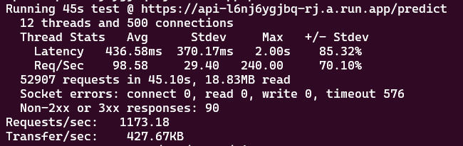

**challenge-mlops**
==============================

El desafío es realizar un modelo y ponerlo en producción para que toda la compañía tenga acceso. Los detalles se encuentran en el directorio "references" en el archivo "Challenge AI Engineer - NeuralWorks.pdf".

**Organización de Proyecto**
------------

    ├── README.md          <- El README de nivel superior para los desarrolladores que utilizan este proyecto.
    ├── data
    │   ├── external       <- Datos de fuentes de terceros.
    │   ├── interim        <- Datos intermedios que han sido transformados.
    │   ├── processed      <- Conjuntos de datos finales y canónicos para el modelado.
    │   └── raw            <- Volcado original e inmutable de datos.
    │
    ├── models             <- Modelos entrenados y serializados, predicciones de modelos o resúmenes de modelos.
    │
    ├── notebooks          <- Cuadernos de Jupyter. 
    │
    ├── references         <- Diccionarios de datos, manuales y otros materiales explicativos.
    │
    ├── requirements.txt   <- El archivo de requisitos para reproducir el entorno de análisis, por ejemplo,
    │                         generado con `pip freeze > requirements.txt`
    │
    └── src                <- Código fuente para uso en este proyecto.
        ├── __init__.py    <- Hace de src un módulo de Python
        |
        ├── features       <- Scripts para convertir datos en características para el modelado
        │   └── build_features.py
        │
        └── models         <- Scripts para entrenar modelos y luego usar modelos entrenados para hacer
            │                 predicciones
            ├── predict_model.py
            └── train_model.py

--------

# **Instalación con ambiente conda**

* Asegúrate de tener conda instalado en tu sistema.
* Clona este repositorio en tu máquina local.
* Navega al directorio del proyecto.
* Crea un nuevo ambiente conda utilizando el archivo requirements.txt:

    conda create -n mi_ambiente --file requirements.txt

Esto creará un nuevo ambiente con el nombre mi_ambiente y con las dependencias especificadas en el archivo requirements.txt.

Activa el ambiente conda:

    conda activate mi_ambiente

Puedes iniciar el servicio con el seguiente comando:

    uvicorn api:app --port 8080

¡Listo! Ahora puedes acceder a la aplicación desde tu navegador en http://localhost:8080/docs

# **Instalación con docker**

* Asegúrate de tener Docker instalado en tu sistema.
* Clona este repositorio en tu máquina local.
* Navega al directorio del proyecto.

Construye la imagen del contenedor utilizando la Dockerfile:

    docker build -t nombre_del_contenedor .

Asegúrate de incluir el punto . al final del comando para que Docker utilice el directorio actual como contexto de construcción.

Ejecuta el contenedor:

    docker run -p 8080:8080 nombre_del_contenedor

Reemplaza puerto_host con el puerto de tu máquina local en el que quieres acceder a la aplicación, y puerto_contenedor con el puerto en el que la aplicación está expuesta en el contenedor.

¡Listo! Ahora puedes acceder a la aplicación desde tu navegador en http://localhost:8080/docs

# **Como se distribuyen los datos y conclusiones (Punto 1)**

A continuación, se presentan algunas conclusiones extraidas del análisis. Para más información de lo realizado, pueden ver el desarrollo de esto en notebooks en el Jupyter Notebook primer_modelo.ipynb.

**conclusiones**

* Gran parte de los vuelos son a destinos de latino america, donde destacan Buenos Aires, Lima y el norte de Chile. Buenos Aires y Lima probablemente se repiten mucho por ser lugares turísticos muy frecuentados, mientras que el norte de Chile probablemente se destaque debido al desplazamiento de trabajadores mineros.
* En el dataset se encuentran equilibrados los vuelos nacionales e internacionales.
* Latam lidera como operador de vuelos y en segundo lugar se encuentra Sky Airlines. El resto de aerolíneas tienen muy pocos vuelos en el dataset.
* Los datos son casi todos del 2017.
* Desde octubre hasta enero y julio por separado parece ser temporada alta, lo cual discrepa con el enunciado.
* Se destaca la poca cantidad de vuelos los días sábados.
* Se destaca la poca cantidad de vuelos por la noche.
* Se puede ver que el dataset es desbalanceado, la mayoría de los datos son de vuelos que no se atrasaron.
* Podemos ver que en los vuelos que se realizan en la mañana tienen una menor tasa de retraso. Esto podría deberse a que durante la mañana hay más personal disponible trabajando, mientras que en la tarde pueden haber menos disponibles por pausas como el almuerzo, y en la noche puede que se tenga menos personal debido a que puede ser más caro pagar dichos horarios al personal.
* Se observa que los vuelos internacionales tienen una mayor tasa de retraso. Probablemente se debe a que los requisitos para vuelos internacionales son más complejos o a condiciones climáticas.
* En los días de la semana se puede ver que existe una relación entre mayor cantidad de vuelos y la tasa de retraso.
* En los meses podemos ver que existe una relación entre la tasa de retraso y las estaciones del año. Esto probablemente se deba al clima.
* Se observa que existen grandes diferencias entre operadores en sus tasas de retraso, lo cual probablemente se deba a la calidad del servicio que ofrecen.
* No parece existir una relación entre la tasa de retraso y el destino del vuelo. Hay algunos países en los cuales la tasa de retraso es alta, pero la cantidad de vuelos que hay a esos países es demasiado baja; se podrían considerar como outliers. Existe una diferencia clara entre ciertos destinos, pero siguen la lógica de los vuelos nacionales e internacionales, en donde los vuelos internacionales tienen una mayor tasa de retraso.

Cabe destacar que los resultados, si bien indican que son mejores que los modelos bases, me parece que el resultado final se podría mejorar bastante incluyendo features externas como podría ser el clima, algunos detalles de fechas como feriados, etc.

# **Generación de columnas adicionales (Punto 2)**

En el Jupyter Notebook primer_modelo.ipynb en el nivel 3 se realizaron los metodos utilizados para crear las nuevas columnas y se guardo el archivo synthetic_features.csv en la carpeta data/interim.

# **Entrenamientos de modelos y selección (Punto 3 y 4)**

En el Jupyter Notebook primer_modelo.ipynb, en el nivel 5, se realizaron los entrenamientos de los modelos.

Lo primero fue seleccionar las características que se utilizarían para el entrenamiento del modelo. Estas se seleccionaron a partir del análisis EDA.

Luego se seleccionó la métrica a utilizar, esta fue la métrica ROC AUC dado que estamos evaluando la predicción de una probabilidad en donde lo hacemos a partir de un dataset desbalanceado.

Se creó un modelo de regresión logística el cual entregó un resultado de ROC AUC de 0.50, lo cual implica que no es mejor que realizar predicciones al azar. Se utilizó este modelo como base.

Posterior a esto se decidió utilizar como modelo XGBoost, dado que puede encontrar relaciones más complejas en los datos comparado con la regresión logística. Como resultados se logró mejorar el ROC AUC a 0.78 en los datos de entrenamiento y se registró un sobreajuste, dado que el ROC AUC para los datos de validación fue de 0.73. Por esto se ajustaron parámetros para reducirlo y no se logró mejorar los resultados de validación, además se redujo los resultados de los datos de entrenamiento para evitar el sobreentrenamiento. Por último, se confirmó que existiera la generalización del modelo con los datos de testing y se consiguió con éxito un resultado de ROC AUC de 0.733.

# **Serialización del modelo y api rest (Punto 5)**

La serealización del modelo se encuentra en la carpeta src. 

Se desarrolló la API utilizando FastAPI ya que esta biblioteca permite levantar una API en cuestión de minutos. Tal y como se muestra en las instalaciones, se puede levantar este servicio para ser probado en donde existe un método POST para realizar las predicciones del modelo. Dejo unos datos de entrada de ejemplo para utilizar en la llamada.

{ 
	"Fecha-I": "2017-01-01 23:30:00", 
	"Des-I": "KMIA", 
	"Emp-I": "AAL", 
	"Fecha-O": "2017-01-01 23:33:00", 
	"Des-O": "KMIA", 
	"Emp-O": "AAL", 
	"DIA": 1, 
	"MES": 1, 
	"AÑO": 2017, 
	"DIANOM": "Domingo", 
	"TIPOVUELO": "I" 
} 

# **Automatizar el proceso de build y deploy (Punto 6)**

Ya que este challenge es de solo 5 dias se tomo la decision de seleccionar una herramienta rapida y escalable, tal y como me parece que deberia ser al momento de generar un prototipo lo más rapido posible. Esta elección fue utilizar los servicios de google cloud build, docker y run. Se genero el archivo cloudbuild.yaml y mediante configuraciónes de google cloud se automatizo la adquisición de los push a la rama main lo cual gatilla la generación de contenedor en la nube y la creación del servicio cloud run para poder que toda la compañia pueda acceder a esta api. Dentro de la consideraciones de la configuración se tuvo en cuenta la region, los tamaños de las maquinas (pequeños), las concurrencias, el maximo numero de instancias y que sea necesario la autentificación por temas de seguridad. Aqui podemos ver un ejemplo de una llamada realizada al servicio ya en producción en google cloud.

Se utilizó una autentificación por bearer token. 
 

# **Pruebas de estrés (Punto 7)** 

Algunas ideas que podrían mejorar el rendimiento de la prueba son:

* Reducir la cantidad de columnas a codificar y predecir por el modelo.
* Cambiar los métodos utilizados con Pandas por una librería más rápida.
* Aumentar la cantidad máxima de instancias disponibles en Cloud Run.
* Aumentar la cantidad de concurrencias y recursos de cada máquina de Cloud Run.

<small>Project based on the <a target="_blank" href="https://drivendata.github.io/cookiecutter-data-science/">cookiecutter data science project template</a>. #cookiecutterdatascience</small>

